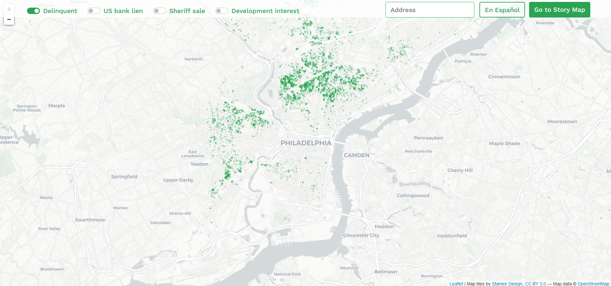

# Data Dashboard for Vacant Lots in Philadelphia

The data dashboard allows you to explore vacant lots in Philadelphia.

With four buttons, you can filter for vacant lots and their statuses including delinquency state, association with US bank lien, history of sheriff sale, and predicted development interest, by turning the buttons on or off. The screenshot shows all vacant lots that are tax delinquent as of now (2022).

As we have developed an algorithm that predicts which properties are at greatest risk of disposition and development, you can click on the development interest button to see the location of these properties. While all points shown here are predicted to be of development interest, the points in red are predicted to be of high interest for this year (2022) if you were back in 2019 and only have information such as change of median income or nearby crime count then.

You can also click on any point to see their information from public records. These include their address information, predicted development risk, delinquency status, whether it was sold as a US bank lien, total amount due, whether it was scheduled for sheriff sales, and the current owner. After you click on the property, it will change its color to maroon to highlight its location. You can reset the color simply by unclicking the point.

In addition, you can also search for specific properties by entering their addresses into the search box on the top right of the screen. After pressing enter, the dashboard will take you to look at the property and its information. As an example, if you are curious about the Iglesias Garden, you could insert its address "425 Arlington St" into the search box. This will take you to its location on the map and tell you that its risk of development is low for the year 2022.
